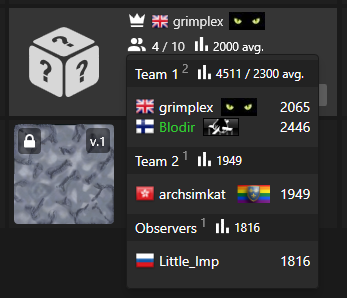

# Login

# Main menu

# Maps vault

# Chat

## Chat features

### Chat helper

### User mention

### Offlient chat

### User interaction

# Maps vault

# Exceptions

## Token error

# Games

## Game patch update

### Demo

# Home

## Concept

## AS IS

### Features

# Lobby

## Version 1

## Version 2

## Version 3

## Version 4

## Lobby preview

## Version 2

# Player context

# Features

## User preview

## User rating change

